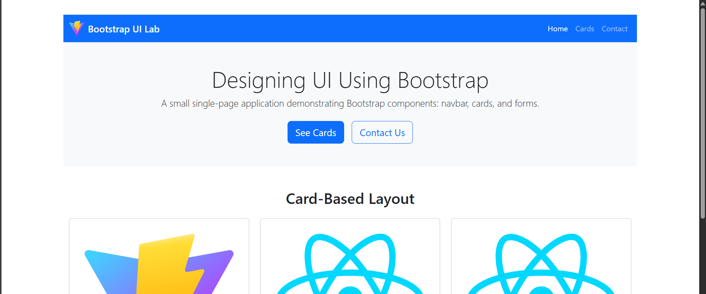
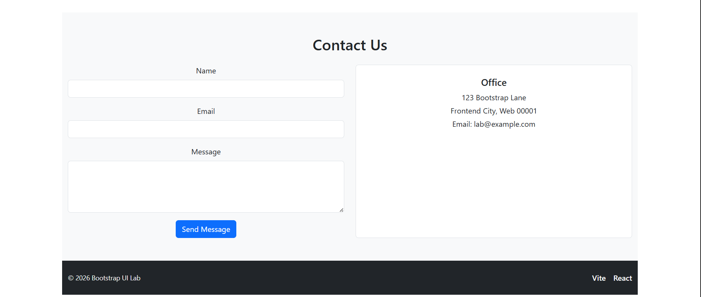
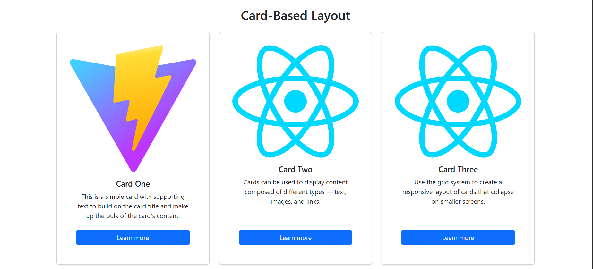
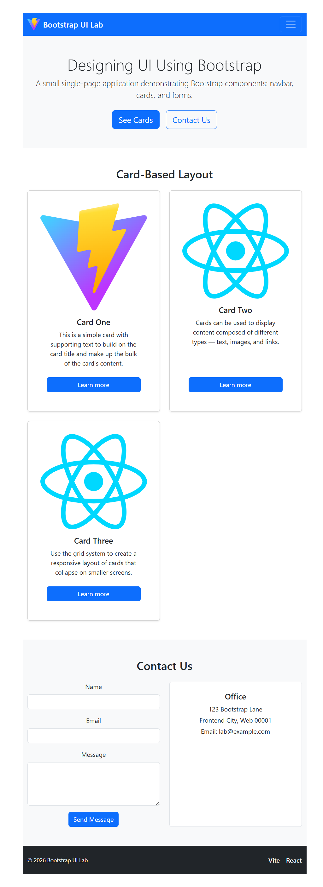

# UI Design Lab — Bootstrap + React (Vite)

Professional lab deliverable for: "UI Design Using Component Libraries — Bootstrap"

## Overview

This repository contains a single-page React application created with Vite that demonstrates practical usage of the Bootstrap 5 component library. The app implements the exercises from the lab: a responsive navigation bar, a hero/landing section, a card-based content layout, and a contact form.

## Aim

Design and implement a responsive UI using Bootstrap components in a React single-page application and document the process, screenshots, and run instructions for verification.

## Software & Dependencies

- Node.js (v14+)
- npm
- React, ReactDOM (managed by Vite)
- Bootstrap 5 (installed via npm and imported in `src/main.jsx`)
- Vite (dev server / build tooling)

## Project highlights (what was implemented)

1. Global Bootstrap 5 integration (CSS imported in `src/main.jsx`).
2. Responsive Navbar with collapse behavior for small screens.
3. Hero section with CTAs demonstrating Bootstrap utilities.
4. Card-based responsive grid using Bootstrap `row` / `col` and `card` components.
5. Accessible contact form using Bootstrap form controls; submissions are logged to the console for demo purposes.

## How to run (local verification)

1. Install dependencies:

```cmd
cd /d C:\Users\TANISHQ\Desktop\mst\my-react-app
npm install
```

2. Start dev server:

```cmd
npm run dev
```

3. Open the URL printed by Vite (commonly `http://localhost:5173`) and verify the UI. Resize the browser to confirm responsive behavior.

## Screenshots (included in this repository)

The repository includes a few PNG screenshots demonstrating the UI and the Vite dev server in action. They are embedded below. If the images do not render on GitHub, confirm the files exist next to this README.

Desktop hero and navbar



Card layout (responsive grid)



Contact form and details panel



Local dev server (Vite) running



## Design notes & testing checklist

- Navbar: verify keyboard accessibility and focus outline on links.
- Cards: check that images scale correctly and actions remain tappable on small screens.
- Form: required field validation is performed client-side; confirm console log entry on submit.

## Repository & submission notes

- `.gitignore` is present to exclude `node_modules` so the repository remains lightweight when pushing to GitHub.
- The contact form intentionally does not submit to a backend; replace `handleSubmit` in `src/App.jsx` to integrate with an API.

## Next steps (optional enhancements)

- Break `src/App.jsx` into modular components (`Navbar.jsx`, `Hero.jsx`, `Cards.jsx`, `Contact.jsx`) for maintainability.
- Add unit/UI tests with React Testing Library.
- Add CI pipeline (GitHub Actions) to run linting and tests on push.

## License & attribution

This material was prepared for educational purposes. Bootstrap is used under its open-source license; see the official Bootstrap repository for license details.

----

If you want, I can now commit this README, then push the change to your GitHub `main` branch and confirm the remote repo shows the updated README and images.
